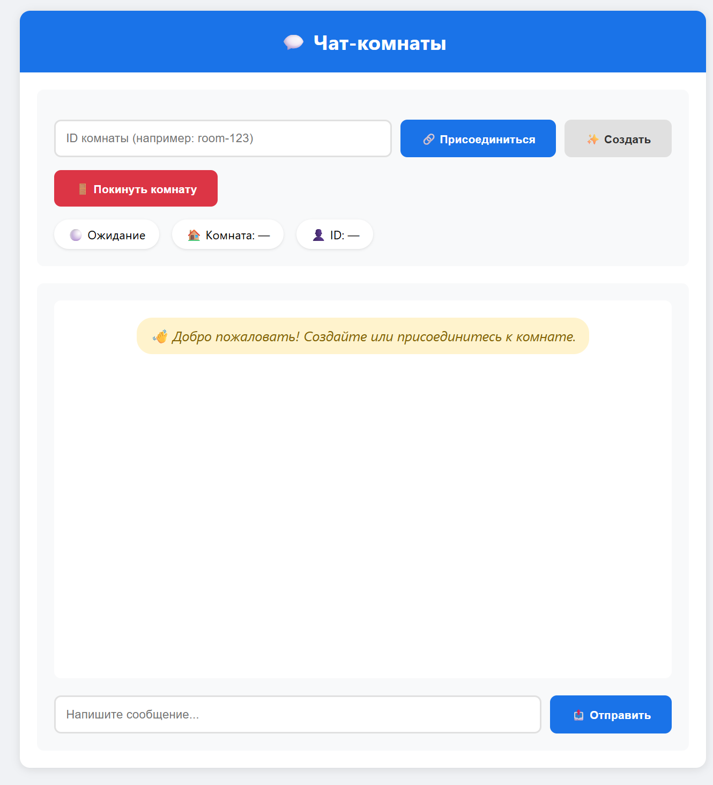
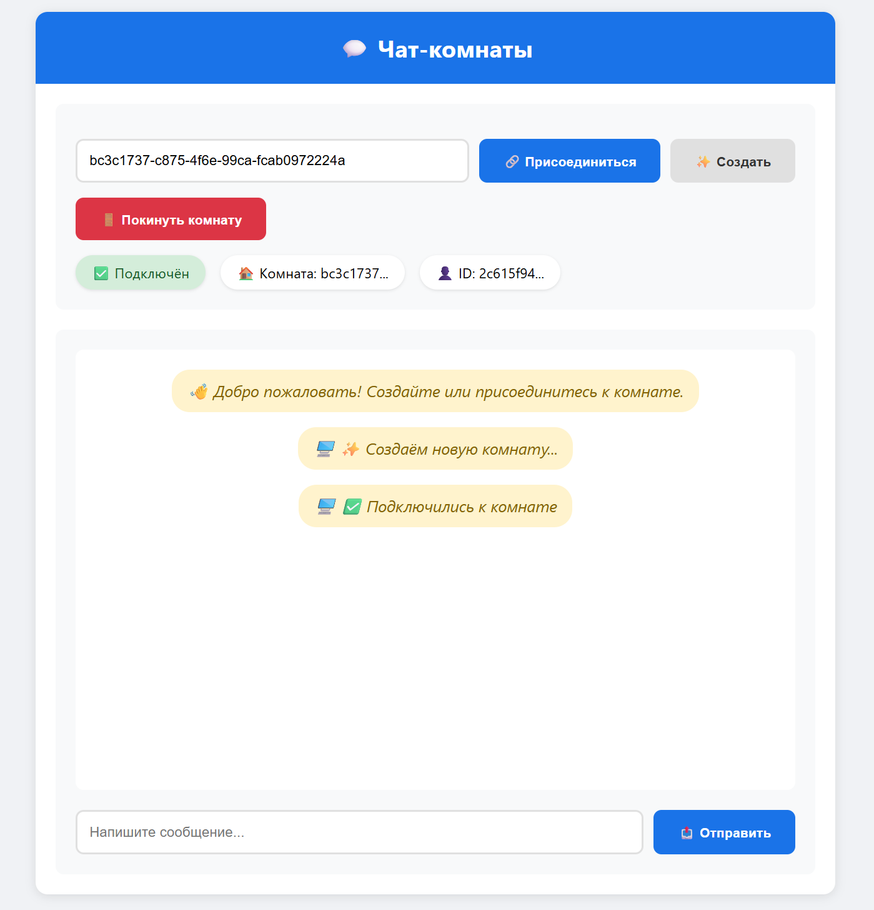
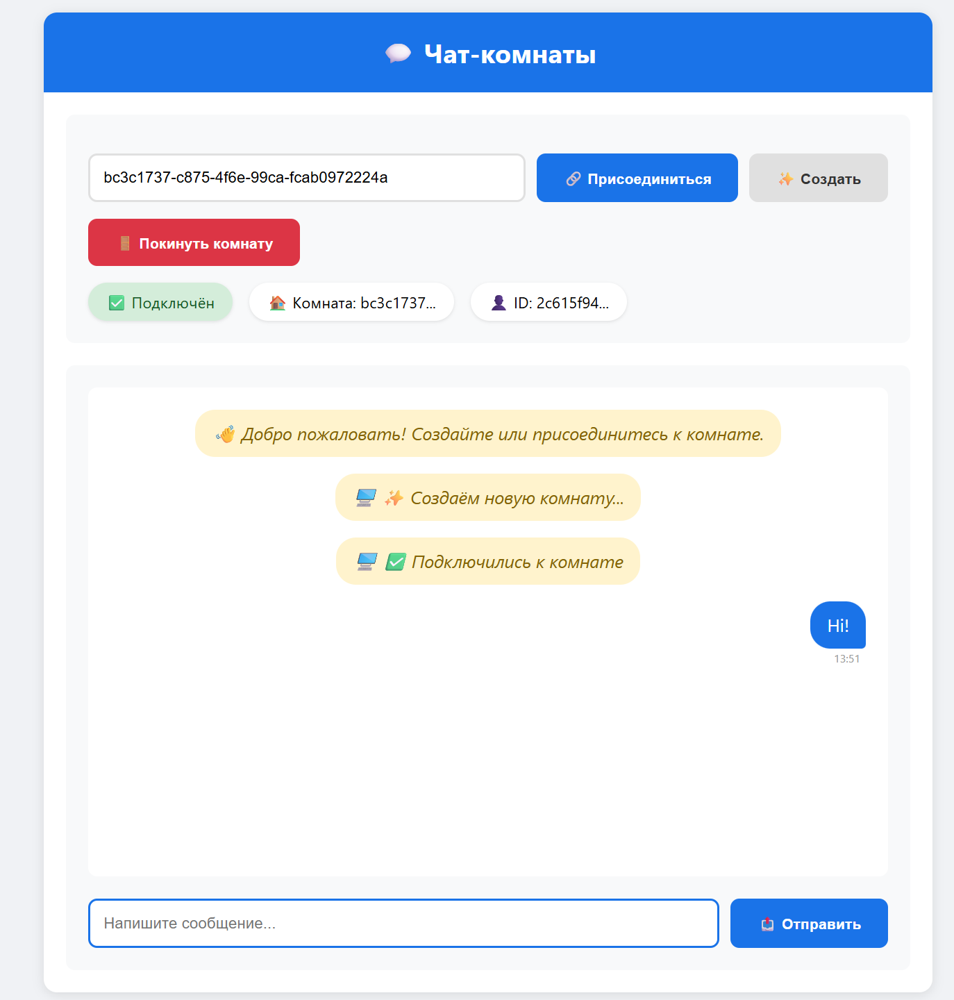
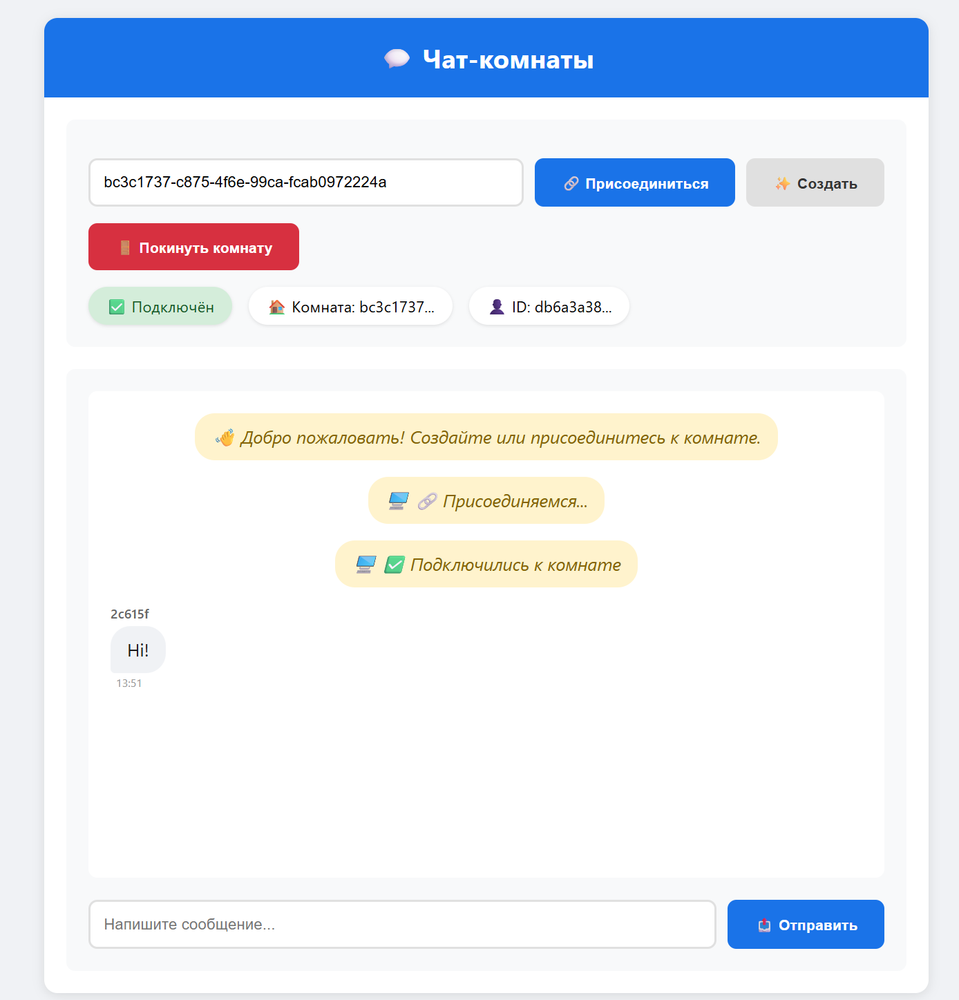
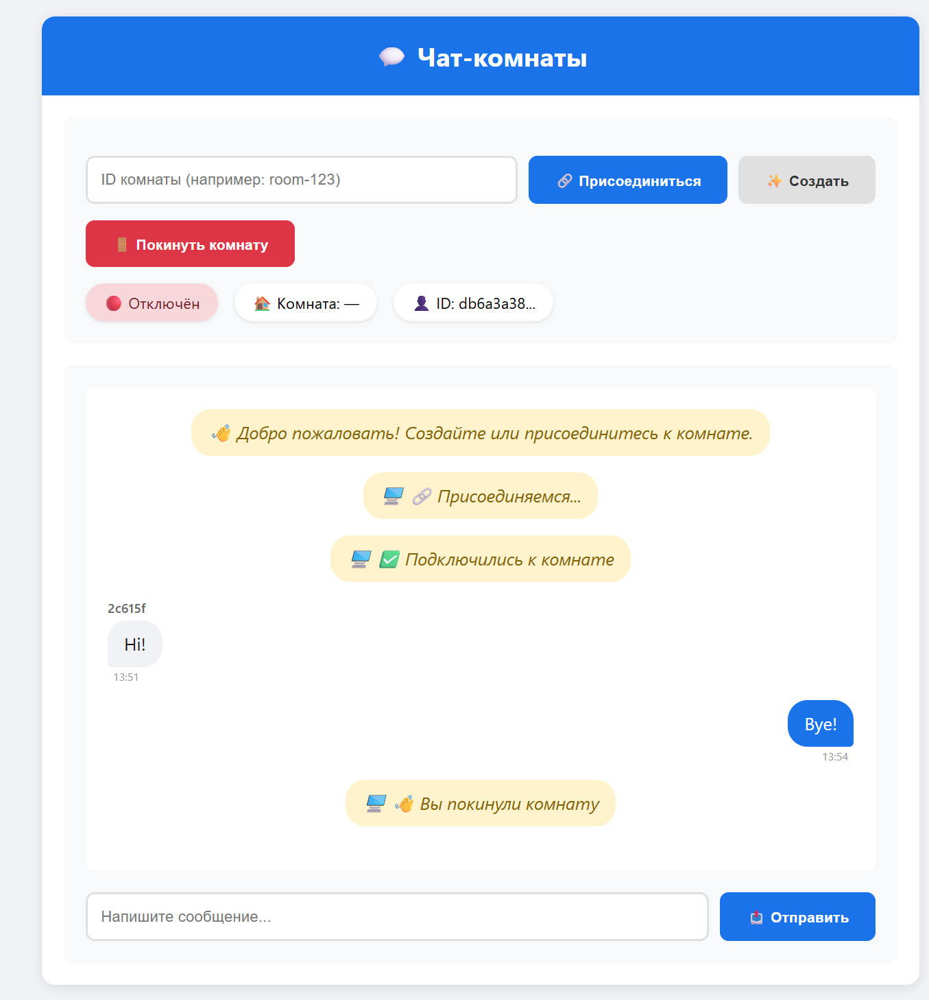

# Онлайн чат (V 1.0.0)
Целью этого небольшого проекта являлась работа с websocket, а также реализовать концепцию сервера с использованием комнат, куда могут подключаться клиенты. В процессе разработки была добавлена ещё одна глобальная цель: поработать с Redis, его типами данных(Sets, strings, Hashes, Lists), а также построить всю архитектуру приложения именно на Redis, так как это несложно в разработке, удобно, и работает достаточно быстро, плюс его удобно горизонтально масштабировать(если бы я просто писал на map внутри оперативы, то ни о каком масштабировании речи бы не шло). В качестве языка программирования был выбран мой любимый Golang. 

## Быстрый старт

1. Клонируем с помощью `git clone https://github.com/JanArsMAI/Caller.git`
2. Запускаем образ redis `docker run --name redis-chat -p 6379:6379 -d redis:alpine`
3. Переходим в папку `backend `      `cd .\backend\`
4. Внутри папки backend должен лежать .env файл, пример которого есть в `.env-example`, поля связанные с LiveKit можно вырезать для быстроты настройки и запуска.
5. `go run .\cmd\main.go`
6. На `http://localhost:8080` будет приложение 

## Общая информация о приложении(как им можно пользоваться?)
Фронтенд был написан на html+css, т.е. бэкенд сам раздаёт статику. 

1. При переходе на страницу сразу виден интерфейс, по которому можно создать, либо подключиться к комнате. 



2. В разделе ID комнаты можно как придумать своё уникальное название, которое удобно вводить вам и вашему собеседнику, а можно нажать кнопку `Создать` и ID комнаты автоматически сгенерируется, комната создастся и будет установлено двустороннее соединение между клиентом и сервером. Если же вам нужно подключиться к комнате собеседника, то вам нужно знать ID комнаты, либо её название, и тогда вы сможете начать общение. 


3. Зайдём в комнату со стороны другого пользователя и посмотрим, как работает приём и отправка сообщений




4. Чтобы выйти из комнаты достаточно нажать кнопку `Покинуть комнату`, если в комнате останется хотя бы 1 участник, то она не будет удалена, но если все пользователи вышли, то комната закроется. 



Это были основные use cases приложения. Всё достаточно просто и интуитивно. Хотелось бы упомянуть, что я также встроил возможность видеочата через `LiveKit`, бэкенд помимо администрированием комнат занимается ещё и выдачей LiveKit токенов. Однако ввиду моих способностей во Фронтенде и ограничений по времени я пока не встроил LiveKit внутрь моего клиента. Думаю, что в будущих версиях я ещё вернусь к этому вопросу. Так как я бэкенд разработчик, то меня в первую очередь интересует написание отказоустойчивого решения с использованием современных технологий и хороших практик. Поэтому посмотрим, как устроена архитектура изнутри. 


## Архитектура решения (и немного теории)

Сердцем, главной технологией и причиной написания этого проекта является websocket. По сути, это надстройка над TCP: также устанавливается двустороннее долгоживущее соединение, тоже есть аналог Handshake(только в TCP он происходит 1 раз, а в вебсокетах постоянно). Главное отличие в том, что TCP передаёт байты, а вебсокеты обмениваются посредством фреймов(сообщений), именно поэтому TCP относится к 4 - транспортному уровню модели OSI, а WebSocket уже относится к прикладному уровню. За счёт своего внутреннего устройства и постоянного Ping/Pong вебсокеты лучше подходят под наше приложение, чем если бы посредством http обменивались данными. Из плюсов вебсокетов я бы выделил:
 - низкая задержка(доставка через вебсокеты практически мгновенная)
 - двунаправленность соединения(в http инициатива идёт от клиента, и только потом сервер отвечает)
 - Polling через http грузит ресурсы нашего сервера, плюс тратит больший трафик, чем вебсокет.

`Но самый главный плюс вебсокетов - простота реализации на уровне кода!`

Посмотрим на код, и на основную логику настройки сокетов. В качестве основного пакета я использовал `net/http`(для поднятия сервера) и `gorilla`(для вебсокетов). 
### Сервер
``` 

type wsServer struct {
	Updater *websocket.Upgrader // именно эта штука превратит наше соединение в веб сокет
	Hub     *hub.Hub //архитектурная концепция, о ней поговорим чуть позже
	Mux     *http.ServeMux  //мультиплексер
	Srv     *http.Server //сам сервер
}

func NewWsServer(hub *hub.Hub, addr string) *wsServer {
	//инициализация
}

func (ws *wsServer) Start() error {
    //запуск хаба в горутине
	go ws.Hub.Run()
	ws.Mux.HandleFunc("/", StaticHandler)
	ws.Mux.HandleFunc("/ws", ws.WebSocketHandler)
	return ws.Srv.ListenAndServe()
}

func (ws *wsServer) Stop(ctx context.Context) error {
	return ws.Srv.Shutdown(ctx)
}

//ручка под статику
func StaticHandler(w http.ResponseWriter, r *http.Request) {
	http.ServeFile(w, r, "index.html")
}

//ручка под вебсокет 
func (s *wsServer) WebSocketHandler(w http.ResponseWriter, r *http.Request) {
    //апгрейдим наше соединение до вебсокета
	conn, err := s.Updater.Upgrade(w, r, nil)
	if err != nil {
		log.Println("Ошибка апгрейда WebSocket:", err)
		return
	}
	roomID := r.URL.Query().Get("room")
	if roomID == "" {
		roomID = uuid.New().String()
	}
    //создаём обьект клиента
	c := &client.Client{
		ID:        uuid.New().String(),
		Conn:      conn,
		Send:      make(chan []byte, 256),
		Room:      roomID,
		UserAgent: r.UserAgent(),
	}
    //в канал регистрации хаба пишем нашего клиента
	s.Hub.Register <- c
	log.Printf("Client with id %s is in room: %s", c.ID, roomID)
	welcomeMsg := map[string]interface{}{
		"type":     "welcome",
		"clientId": c.ID,
		"roomId":   roomID,
	}
    //отправляем сообщение клиенту о том, что он попал в комнату
	if err := conn.WriteJSON(welcomeMsg); err != nil {
		log.Printf("Error to send welcome: %v", err)
	}
    //в фоне запускаем процессы чтения и записи сообщений
	go c.WritePump()
	go c.ReadPump(s.Hub.BroadcastToRoom)
}
```

Всё сводится к одному методу Upgrade, которое превращает наше соединение в вебсокет, далее мы уже передаём в структуру Client это соединение и можем в любой момент что-то получить или записать в него. Именно по этой причине в конце метода мы запускаем горутины: одна отвечает за запись, другая - за чтение и броадкастинг сообщения в комнате. 
### Client
Посмотрим на `Client`

```
type Client struct {
	ID        string     //id клиента
	Conn      *websocket.Conn  //соединение клиента, по которому мы можем общаться
	Send      chan []byte  //канал под сообщения, чтобы была возможность всё делать конкурентно и использовать как буфер
	Room      string //комната, в которой клиент
	UserAgent string //метаданные 
}

//чтение сообщения и активация броадкаста(функция рассылки сообщения всем клиентам в комнате)
func (c *Client) ReadPump(broadcast func([]byte, string))

//запись сообщений в канал клиента
func (c *Client) WritePump()
```

Стоит упомянуть, что сообщения хранятся как в канале, так и Redis: канал нужен для быстроты и поддержки асинхронной обработки и уведомлений клиентов, которые находятся в комнате в данный момент, а вот Redis нужен для хранения истории внутри комнаты, т.е. редис используется как некое хранилище, в которое мы можем обратиться за информацией о комнате и получить историю за 24 часа. Далее посмотрим на `Hub` - ключевую сущность всей системы, которая всегда работает в фоне и управляет всем происходящим. 

### Hub
```
type BroadcastMsg struct {
	Message  []byte
	RoomID   string
	ClientID string
}

type Hub struct {
	connections map[string]*client.Client
	Register    chan *client.Client
	Unregister  chan *client.Client
	Broadcast   chan BroadcastMsg
	LiveKitCfg  *livekit.LiveKitConfig
	quit        chan struct{}

	redisRepo *redisrepo.RedisRepo
	ctx       context.Context
	cancel    context.CancelFunc
}
``` 
Помимо Хаба я ещё определил структуру сообщения, которое будет ходить по каналу Broadcast. Также в структуре есть контекст для управлением жизни нашей сущности, и cancelFunc, которая будет вызвана для остановки работы Хаба. Есть map, которая хранить все соединения, чтобы было возможно вернуться к нужному соединению по Id пользователя. И 2 вспомогательных канала для обработки входа/выхода клиентов из комнаты. Каналы здесь нужны для потокобезопасности, так как если несколько горутин будут писать в одну мапу без мьютекса, то определённо будет data race и всё, хана приложению. Мьютекс - как один из вариантов решения проблемы, но на каналах решение чище, проще и эстетичнее( `sync.Map` не хотел использовать, так как на каналах такой хаб писать намного интереснее). И одно из полей - конфиг под LiveKit, про который я уже упомянул, по сути, это поле нужно для 1 функции, которая управляет токенами доступа к LiveKit облаку, где и происходят все видео и аудио передачи. 

### Методы Hub

| Метод | Назначение | Где используется |
|:------|:-----------|:------------------|
| `NewHub()` | Конструктор, инициализирует каналы и Redis | `main.go` |
| `Run()` | Главный цикл обработки событий | `server.Start()` (в горутине) |
| `listenToRedis()` | Подписка на Redis Pub/Sub | Запускается из `Run()` |
| `sendLiveKitToken()` | Генерация и отправка LiveKit токена | `Run()` при регистрации |
| `BroadcastToRoom()` | Отправка сообщения в канал | `client.ReadPump()` |
| `GetRoomClients()` | Получение списка участников | Внешние вызовы |
| `Stop()` | Остановка хаба | `main.go` при shutdown |

Более подробно о реализации можно почитать в самом коде. 

### Redis Repo(слой для работы с Redis)
И самое интересное для меня в этом проекте помимо  `websockets`- работа с Redis, обычно я использовал редис просто как чёрный ящик, без использования типов данных, без понимания того, какие типы вообще есть, и какие возможности они дают. Помимо обычных строк и списков в Redis можно заводить множества и хэши(по сути, как мапа, просто храним метаданные в том же формате `ключи:значения`). Для работы с Redis я выделил целый repo уровень в моём приложении, в котором хранятся уже заготовленные под мою логику методы, чтобы я вызывал их из слоя приложения, не вдаваясь в детали реализации, а также каких-то секретных данных, которые нужны для подключения к Redis   (Думаю, что очевидно, что если сервер или хаб будут знать конфиги к Redis и постоянно хранить их, то будет не круто. Зачем нам перегружать нашу структуру, нарушая S и D из SOLID). Следовательно, получился слой для работы с redis, я распилил пакет на несколько файлов. 

1. `errors.go` - ошибки, которые я посчитал нужным вынести в отдельный файл(но можно было обьявить их и в файле с репо)
2. `models.go` - модели данных, нужные для конвертации между Redis и Go
3. `redis-connection.go` - инициализация соединения
4. `redis-keys.go` - удобный набор заготовленных строк для подстановки в repo
5. `redis-repo.go` - сама repo и её методы. 

На будущее, я написал чуть больше методов, чем можно, но из интереса к работе Redis решил написать полноценную и готовую реализацию repo. 

| Категория | Метод | Описание |
|:----------|:------|:---------|
| **Клиенты** | `AddClient()` | Добавляет клиента в комнату |
| | `RemoveClient()` | Удаляет клиента |
| | `GetClientRoom()` | Комната клиента |
| | `GetClientInfo()` | Метаданные клиента |
| | `ClientExists()` | Проверка существования |
| **Комнаты** | `GetRoomClients()` | Список участников |
| | `GetRoomClientsCount()` | Количество участников |
| | `IsClientInRoom()` | Проверка участника |
| | `GetActiveRooms()` | Активные комнаты |
| | `GetRoomStats()` | Статистика комнаты |
| | `RoomExists()` | Проверка комнаты |
| **Сообщения** | `PublishMessage()` | Отправка в Pub/Sub |
| | `SubscribeRoom()` | Подписка на комнату |
| | `SubscribeAllRooms()` | Подписка на всё |
| | `SaveMessage()` | Сохранение в историю |
| | `GetRecentMessages()` | История сообщений |
| **Админ** | `ClearRoom()` | Очистка комнаты |
| | `GetAllStats()` | Общая статистика |
| | `HealthCheck()` | Проверка Redis |
| | `Close()` | Закрытие соединения |
Таким образом, мы разобрали основные компоненты нашего приложения. 

## TODO: 
1. Сделать архитекутуру ещё более чистой, выделить сборку в di слой
2. Добавить ручки для анализа, админки и прочего. 
3. Добавить поддержку медиаданных(добавить S3)
4. Настроить метрики приложения 
5. Попробовать ещё раз интегрировать видеосвязь на фронтенде. 